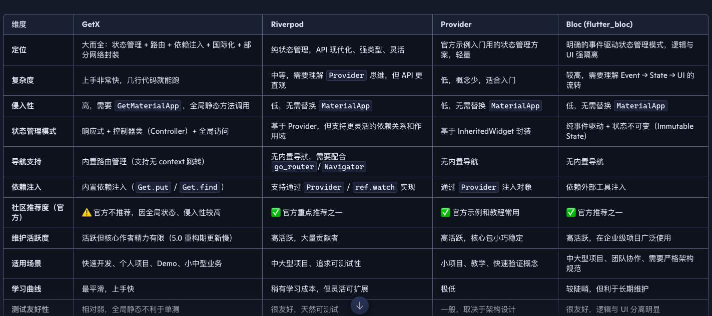

# flutter riverpod 模版
本项目基于 Flutter 官方推荐的 riverpod 架构，集成了常用功能模块，适用于中大型项目开发。通过统一封装和模块化设计，提升开发效率、增强可维护性，并支持多语言、多主题、权限管理等功能。
---

## 📦 项目核心功能模块

### 1. 状态管理：riverpod 架构
- 官方推荐架构，拥有更多贡献者，长期维护更有保障

### 2. 包管理优化
- 所有依赖包活跃度高，维护积极
- 有利于打包体积优化，提升运行性能

### 3. 网络请求封装
- 基于 `dio` 封装统一请求响应处理
- 支持请求拦截器，自动处理 401 / 403 未授权状态码

### 4. 权限管理
- 封装统一权限请求方法，简化权限申请流程

### 5. 多语言 & 多主题支持
- 支持国际化（i18n）
- 支持动态主题切换（深色/浅色）

### 6. 路由管理
- 使用官方推荐路由库，统一路由配置与跳转逻辑

### 7. UI 组件封装
- 统一弹窗、轻提示、加载动画
- 错误页面、空页面统一处理

### 8. 用户授权管理
- 登录状态统一管理
- 支持未登录/已登录逻辑分离

### 9. 分页加载
- 封装上拉/下拉分页请求逻辑，支持加载更多

### 10. 图片处理组件
- 网络图片 / 缓存图片组件
- 本地路径图片 / 内存图片组件

### 11. 缓存管理
- 封装统一缓存处理逻辑，支持本地存储与清理

### 12. App 设置管理
- 统一管理应用设置项，如语言、主题、通知等

### 13. 全局异常捕获
- 支持全局错误处理与日志记录，提升稳定性

### 14. 日志系统
- 统一日志记录机制，便于调试与问题追踪
---

## 📊 状态管理方案对比图

以下是 Flutter 主流状态管理方案的对比图，包括 GetX、Riverpod、Provider 和 Bloc：

---

## ❌ 为什么不推荐使用 GetX

虽然 GetX 在小型项目中使用便捷，但在中大型项目中存在以下问题：

### 1. 维护风险高
- GetX 主要由一位律师维护，贡献者极少
- 5.0 版本自 2023 年起开发至今仍未进入预发布阶段
- 更新频率低，有弃坑风险

### 2. 项目结构混乱
- 全局静态处理方式易导致项目不可控
- 单元测试困难，模块隔离性差

### 3. 官方不推荐
- 高侵入性架构，未来 Flutter 若发生重大变更，维护成本极高

### 4. 版本前景不明
- 4.0 虽可用，但依赖包已过时
- 5.0 长期难产，稳定性堪忧

### 5. 文档与测试不足
- API 注释不完整，测试覆盖率低

### 6. 状态控制不精细
- `Obx` 等状态监听机制易导致重复渲染，影响性能

### 7. 维护不积极
- github上有1000多个issues没有处理，90多个贡献未合并
---

## 🧩 适用场景

- 中大型 Flutter 项目
- 需要高可维护性、模块化架构的应用
- 多语言、多主题、权限控制等复杂业务场景

---

## 📌 结语

本模板旨在提供一个稳定、可扩展的 Flutter 项目基础架构，帮助开发者快速启动项目并保持长期可维护性。如有建议或反馈，欢迎提交 Issue 或 PR！
### 多语言生成命令
`dart run intl_translation:extract_to_arb --output-dir=i10n-arb lib/i18n/localization_intl.dart`

`dart run intl_translation:generate_from_arb --output-dir=lib/i18n --no-use-deferred-loading lib/i18n/localization_intl.dart i10n-arb/intl_*.arb`
### 编译为apk
`flutter build apk --obfuscate --split-debug-info=/Users/user/Desktop/aivox/build/app --release`
### 安装生成包
`/Users/user/Library/Android/sdk/platform-tools/adb install /Users/user/Desktop/aivox/build/app/outputs/flutter-apk/app-release.apk`
